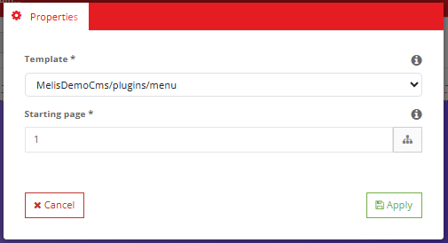
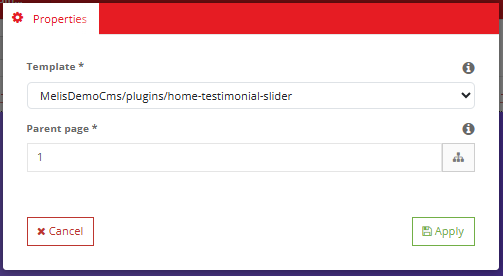
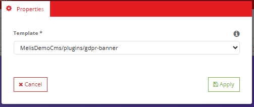

# MelisFront (React back-office) — Functional & Technical Documentation (for AI)

> **What this is.** MelisFront is the **front-office rendering system** of Melis — it turns a URL
> into a finished public page and ships the **content blocks (page plugins)** authors drop onto
> pages. **It has NO standalone React tool** — no left-menu entry, no brick, no `react-api`
> endpoints. Its presence in the new React back-office (`/melis-react`) is entirely through the
> **page plugins you configure inside the React CMS page editor**: breadcrumb, menu, list-from-folder,
> GDPR banner, plus the in-place **HTML** and **Media** tags. The 6 screenshots in this doc are those
> plugins' configuration as seen in the page editor. For the render pipeline, listeners, services,
> view helpers and the full plugin catalogue, see the [legacy doc](./MelisFront.md) — this doc does
> not repeat them.
>
> **How this document is organised — two clearly separated parts:**
> - **[Part A — Functional Guide](#part-a--functional-guide)** — for everyday users (and the
>   chat assistant) using the React back-office. Plain language.
> - **[Part B — Technical Reference](#part-b--technical-reference)** — for developers and AI
>   working with these plugins and the React page editor, with real config identifiers.
>
> **Audience**: consumed by the **MelisAI** MCP. **Status**: reviewed 2026-08-19.

---

## 0. Where this lives in the React back-office — read this first

- **No brick, no tool, no react-api.** MelisFront ships **no** `ui-react/`, **no**
  `public/ui-react/brick.manifest.json`, and **no** `config/react-api.php` /
  `config/react.capabilities.php`. It never appears in the left menu of `/melis-react`. There is
  nothing to "open" for MelisFront.
- **Its React surface = page plugins configured in the CMS page editor.** You meet MelisFront when
  you edit a page: **MelisCms → open a page → Edition tab**. That Edition tab is the **legacy page
  editor rendered in an iframe inside the React shell** (`/melis/react-tool-page?key=meliscms_page`).
  Inside it you drag MelisFront's blocks onto zones and open their **Properties** modal.
- **Two kinds of block** (both from MelisFront):
  - **"Tag" blocks** you edit **in place** on the page — **HTML** (rich text) and **Media** (image/file).
  - **"Config" blocks** you set up through a **Properties modal** — **Menu**, **Breadcrumb**,
    **List-from-folder**, **GDPR banner**. They generate content from the page tree / site config.
- **The config modal UI is generic, not React-per-module.** Each plugin declares a `modal_form`
  (Laminas form spec) in `config/plugins/<Plugin>.config.php`; the platform renders it via
  `MelisPluginRendererController`. The React page editor simply hosts that legacy editor in the
  Edition iframe — MelisFront contributes **no** React component of its own.
- **Coupled modules.** MelisFront is part of the **MelisCms / MelisFront / MelisEngine** trio — the
  page editor itself lives in **MelisCms** (React brick), the data model in **MelisEngine**. See the
  [legacy doc §0](./MelisFront.md) and the MelisCms React doc for the editor's own React UI.

---
---

# PART A — Functional Guide

## A1. What you can do with MelisFront in the new back-office

You never open MelisFront as a tool. In `/melis-react` you use it by **placing and configuring its
blocks on a page** (in the MelisCms page editor's **Edition** tab):

- **Write content** — drop an **HTML (Text)** block or a **Media** block and edit it directly on the page.
- **Add a navigation menu** — drop the **Menu** block; it builds itself from your page tree.
- **Add a breadcrumb** — drop the **Breadcrumb** block ("Home › Section › Page").
- **List sub-pages automatically** — drop the **List-from-folder** block to repeat a folder's child pages.
- **Show the cookie/GDPR banner** — drop the **GDPR banner** block.

Each block's behaviour is set in a small **Properties** modal (for the "config" blocks) or typed
**in place** (for the "tag" blocks).

## A2. Finding it in /melis-react

**Where:** left sidebar → **MelisCms** → open a **page** → **Edition** tab → the **plugins** panel
→ drag a block into a zone. There is **no MelisFront entry** in the sidebar; everything happens
inside the page editor.

> **How to add a block:** page editor → plugins menu → **drag** a block into a page zone → click it.
> A "tag" block opens an in-place editor; a "config" block opens its **Properties** modal.

## A3. Key words explained

- **Page plugin (block)** — a reusable piece dropped on a page. MelisFront ships the standard ones.
- **Tag block** — content you type/pick in place (HTML, Media).
- **Config block** — a dynamic block set up via a **Properties** modal (Menu, Breadcrumb, List-from-folder, GDPR).
- **Template** — the `.phtml` view that renders a block (chosen in the modal's **Template** dropdown).
- **Starting / Parent page** — the point in the page tree a Menu / Breadcrumb / List block starts from.

> For the domain glossary, the front render pipeline and the full plugin catalogue, see the
> [legacy doc](./MelisFront.md).

## A4. HTML (Text) block — edit in place

The workhorse block: a **rich-text area** (TinyMCE) for titles, paragraphs, links and formatted
content. You edit it **directly on the page** — there is no Properties modal.


*The editable HTML block — a full WYSIWYG toolbar (paragraph/font/size, bold/italic, alignment, lists, link, image, table, media, code) right on the page.*

## A5. Media block — pick an image/file in place

Places an **image or file** on the page, picked from the media library. Also edited in place (a
small toolbar with an "Add media content here" placeholder), not through a modal.


*The Media block — a compact in-place toolbar with the "Add media content here" placeholder.*

## A6. Menu block — settings

Builds a **navigation menu automatically from the page tree**. Its **Properties** modal has two
fields: the **Template** that renders it and the **Starting page** (where in the tree the menu begins).


*The Menu block's Properties — Template (here `MelisDemoCms/plugins/menu`) and Starting page (with a sitemap picker button).*

## A7. Breadcrumb block — settings

Renders the "you are here" trail. Its **Properties** modal has the **Template** and the **Starting
page** (the breadcrumb's root).


*The Breadcrumb block's Properties — Template (`MelisFront/breadcrumb`) and Starting page.*

## A8. List-from-folder block — settings

Takes a **folder in the page tree and lists its child pages** automatically. Its **Properties**
modal picks the **Template** (how each item renders) and the **Parent page** (the source folder).


*The List-from-folder Properties — Template (here `MelisDemoCms/plugins/home-testimonial-slider`) and Parent page (the source folder, with sitemap picker).*

## A9. GDPR banner block — settings

The **cookie/consent banner** shown on the public site. Its **Properties** modal only needs the
**Template** (its wording comes from the site's GDPR texts).


*The GDPR banner Properties — a single Template field (`MelisDemoCms/plugins/gdpr-banner`).*

## A10. Common tasks — "How do I…?"

- **Add body text** → page editor → Edition → drag **HTML** block → type/format in place.
- **Add an image** → drag **Media** block → pick from the media library.
- **Add a menu** → drag **Menu** block → set **Template** + **Starting page** → Apply.
- **Add a breadcrumb** → drag **Breadcrumb** block → set **Template** + **Starting page** → Apply.
- **List a folder's sub-pages** → drag **List-from-folder** block → set **Template** + **Parent page** → Apply.
- **Show the cookie banner** → drag **GDPR banner** block → pick **Template** → Apply.

> Full step-by-step for the page editor (drag, save, publish) is in the MelisCms React doc; the
> underlying front rendering is in the [MelisFront legacy doc](./MelisFront.md).

---
---

# PART B — Technical Reference

## B1. React presence at a glance

| Item | Value |
|---|---|
| Brick kind | **None** — no `ui-react/`, no `brick.manifest.json`, no `react-api.php`, no `react.capabilities.php` |
| Left-menu tool | **None** — MelisFront never appears in the `/melis-react` sidebar |
| React surface | **Front page plugins** configured inside the **MelisCms page editor** (Edition iframe) |
| Editor host | MelisCms React page editor → Edition tab = legacy editor in an iframe `/melis/react-tool-page?key=meliscms_page` |
| Plugin config UI | Generic Laminas `modal_form` per plugin, rendered by `MelisFront\Controller\MelisPluginRendererController` |
| Owns DB tables? | **No** — all data via MelisEngine (see [legacy doc §B1](./MelisFront.md)) |

## B2. How the plugins reach the React editor

1. **The editor is legacy-in-React.** The MelisCms React brick renders the page editor; its
   **Edition** tab embeds the classic drag-drop editor in an iframe (`CmsPage.tsx`,
   `/melis/react-tool-page?key=meliscms_page`). All plugin drag-drop and property modals run **inside
   that iframe** — MelisFront ships no React code.
2. **Plugins are `controller_plugins`** extending `MelisEngine\Controller\Plugin\MelisTemplatingPlugin`
   (see `src/Controller/Plugin/`). MelisFront ships 14 plugin classes; the ones surfaced in the
   screenshots are:
   | Screen | Plugin class | Config file |
   |---|---|---|
   | HTML tag | `MelisFrontTagHtmlPlugin` (→ `MelisFrontTagPlugin`) | `config/plugins/MelisFrontTagPlugin.config.php` |
   | Media tag | `MelisFrontTagMediaPlugin` (→ `MelisFrontTagPlugin`) | `config/plugins/MelisFrontTagPlugin.config.php` |
   | Menu | `MelisFrontMenuPlugin` | `config/plugins/MelisFrontMenuPlugin.config.php` |
   | Breadcrumb | `MelisFrontBreadcrumbPlugin` | `config/plugins/MelisFrontBreadcrumbPlugin.config.php` |
   | List-from-folder | `MelisFrontShowListFromFolderPlugin` | `config/plugins/MelisFrontShowListFromFolderPlugin.config.php` |
   | GDPR banner | `MelisFrontGdprBannerPlugin` | `config/plugins/MelisFrontGdprBannerPlugin.config.php` |

   Other MelisFront plugins (not in the screenshots): `MelisFrontTagTextareaPlugin`,
   `MelisFrontBlockSectionPlugin`, `MelisFrontGenericContentPlugin`, `MelisFrontDragDropZonePlugin`,
   `MelisFrontGdprRevalidationPlugin`, `MelisFrontSearchResultsPlugin`, `MiniTemplatePlugin`.
3. **The Properties modal is data-driven.** Each "config" plugin declares a `melis.modal_form`
   in its config file — a Laminas form spec. The platform renders it; there is **no per-plugin React
   component**. The two recurring field types are:
   - **`MelisEnginePluginTemplateSelect`** → the **Template** dropdown (field name `template_path`).
   - **`MelisText`** with `data-button-icon => 'fa fa-sitemap'` → the **Starting/Parent page** input
     with the page-tree (sitemap) picker button.

## B3. The plugin config modals — real field names

Derived verbatim from `config/plugins/*.config.php`:

| Plugin | `modal_form` fields (name / type) | Modal tab / template |
|---|---|---|
| **Breadcrumb** | `template_path` (`MelisEnginePluginTemplateSelect`) · `pageIdRootBreadcrumb` (`MelisText`, sitemap) | `breadcrumb_tab1` · `MelisFront/breadcrumb/melis/form` |
| **Menu** | `template_path` · `pageIdRootMenu` (`MelisText`, sitemap) | `MelisFront/menu` layout |
| **List-from-folder** | `template_path` · `pageIdFolder` (`MelisText`, sitemap) | `MelisFront/show-list-from-folder` |
| **GDPR banner** | `template_path` only | `melis_cms_gdpr_banner_plugin_settings_form` · `MelisFront/modal-template-form` |

Front defaults (the `front` config block) — e.g. Breadcrumb `template_path => ['MelisFront/breadcrumb']`,
`pageIdRootBreadcrumb => 1`; Menu `template_path => ['MelisFront/menu']`, `pageIdRootMenu => 1`;
List `template_path => ['MelisFront/show-list-from-folder']`, `pageIdFolder => 1`; GDPR
`template_path => ['MelisFront/gdpr-banner']`. The labels are i18n keys (`tr_melis_Plugins_Template`,
`tr_front_plugin_breadcrumb_root_page`, …). The **HTML/Media** "tag" blocks are edited **in place**
(no `modal_form`) — they render TinyMCE in the canvas.

> **Note on rights.** These plugins carry `conf.rightsDisplay => 'none'` (breadcrumb) — they are not
> gated by a rights tree node; there is **no** `react.capabilities.php`. Access is governed by the
> page editor's own rights (MelisCms), not by MelisFront.

## B4. Server-side rendering & the renderer controller

The plugins render **server-side** in two situations, both defined in MelisFront:

- **On the public site** — the page's `.phtml` template calls the templating plugins during the
  front render pipeline (`EVENT_DISPATCH`/`EVENT_FINISH` listeners) — see [legacy doc §B4/§B12](./MelisFront.md).
- **In the editor / on demand** — `MelisFront\Controller\MelisPluginRendererController` re-renders a
  single plugin:
  - `getPluginAction()` (route **`/melispluginrenderer`**) — AJAX render of one plugin; also serves the
    drag-drop and plugin-edition flows (`editPluginAction`, `dndLayoutAction`, `dndUpdateOrderAction`,
    `dndRemoveAction`). This is what the Edition iframe calls when you drop/edit a block.
  - `MelisSiteActionController` — front site actions (form posts etc.).

The **Properties modal** you see (screenshots) is the plugin's `modal_form` rendered by the legacy
plugin-edition JS inside the Edition iframe; **Apply** posts the values back and the drag-drop layer
persists them into the page's session XML (auto-saved by the legacy plugins). React is not involved
in that round-trip.

## B5. Host integration (what React does / doesn't do)

- **Discovery.** MelisFront ships no `brick.manifest.json`, so `GET /melis/react-api/react-modules`
  never lists it and `melis-core/ui-react/src/lib/bricks.ts` loads no bundle for it.
- **No menu mapping.** With no `forwardKey`, `useNavMenu` has nothing to route — MelisFront is invisible
  in the sidebar by design.
- **The only React touch-point** is the MelisCms page editor hosting the legacy Edition iframe; the
  plugin UI is entirely legacy PHP/JS inside that iframe. See `melis-cms/ui-react/src/CmsPage.tsx`
  (`react-tool-page?key=meliscms_page`).

## B6. Quick code map

```
melis-front/
├── config/
│   ├── module.config.php                 routes (/melispluginrenderer, front render…), controller_plugins, view helpers
│   └── plugins/                          ONE config file per plugin (front defaults + melis.modal_form)
│       ├── MelisFrontBreadcrumbPlugin.config.php     template_path + pageIdRootBreadcrumb
│       ├── MelisFrontMenuPlugin.config.php           template_path + pageIdRootMenu
│       ├── MelisFrontShowListFromFolderPlugin.config.php  template_path + pageIdFolder
│       ├── MelisFrontGdprBannerPlugin.config.php     template_path only
│       ├── MelisFrontTagPlugin.config.php            HTML / Media in-place tags
│       └── … (BlockSection, GenericContent, Textarea, Search, GdprRevalidation, MiniTemplate)
├── src/Controller/
│   ├── MelisPluginRendererController.php  getPlugin / editPlugin / dnd* — renders plugins for the editor iframe
│   ├── MelisSiteActionController.php      front site actions
│   └── Plugin/                            14 templating plugins (extend MelisEngine MelisTemplatingPlugin)
│       └── MelisFrontBreadcrumbPlugin.php · MelisFrontMenuPlugin.php · MelisFrontShowListFromFolderPlugin.php
│          · MelisFrontGdprBannerPlugin.php · MelisFrontTagHtmlPlugin.php · MelisFrontTagMediaPlugin.php · …
└── etc/MelisAI/doc/                       MelisFront.md (legacy) · MelisFront-react.md (this) · images/ · images/react/

NO ui-react/ · NO public/ui-react/ · NO config/react-api.php · NO config/react.capabilities.php
```

> Business logic stays server-side (front render pipeline + templating plugins). The React back-office
> only *hosts* the legacy page editor (MelisCms brick) in which these plugins are dropped and configured.
> Render pipeline, listeners, services, view helpers and the full plugin catalogue: [MelisFront.md](./MelisFront.md).

---

## Screenshot index

Filename → content lookup for the MelisAI MCP. All under `./images/react/`.

| Image file | Content |
|---|---|
| `melisfront-page-plugin-html-tag.png` | HTML (Text) block edited in place — full TinyMCE WYSIWYG toolbar on the page |
| `melisfront-page-plugin-media-tag.png` | Media block in place — compact toolbar, "Add media content here" placeholder |
| `melisfront-page-plugin-menu-config-properties.png` | Menu block Properties modal — Template + Starting page (sitemap picker) |
| `melisfront-page-plugin-breadcrumb-config-properties.png` | Breadcrumb block Properties modal — Template `MelisFront/breadcrumb` + Starting page |
| `melisfront-page-plugin-folderlisting-config-properties.png` | List-from-folder Properties modal — Template + Parent page (source folder) |
| `melisfront-page-plugin-gdprbanner-config-properties.png` | GDPR banner Properties modal — single Template field |

---

*Document for AI consumption (MelisAI MCP) — React back-office of `melisplatform/melis-front`.
MelisFront has **no standalone React tool**; this doc covers its **front page-plugins** configured
inside the React CMS page editor and its front-rendering role. Legacy tool doc:
[./MelisFront.md](./MelisFront.md). Last reviewed 2026-08-19.*
