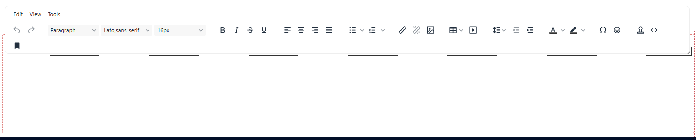
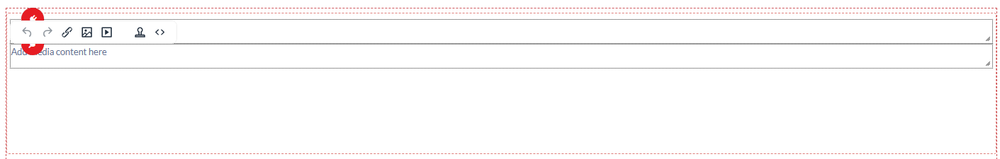
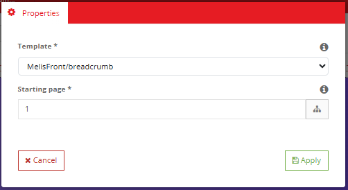

# MelisFront — Functional & Technical Documentation (for AI)

> **What this is.** MelisFront is the **system that displays your websites to visitors**. It
> turns a web address into a finished page, and it provides the **content blocks (plugins)**
> and **template helpers** that editors and site-builders use to put menus, text, images,
> breadcrumbs, GDPR banners, search and more onto pages. It is also what powers the **live,
> editable preview** inside the back-office (MelisCms).
>
> **How this document is organised — two clearly separated parts:**
> - **[Part A — Functional Guide](#part-a--functional-guide)** — for **users / site builders**
>   (and the chat assistant): the content blocks you can add to a page, what each one does, and
>   the front-office behaviours (friendly URLs, sitemap, search, cookie banner).
> - **[Part B — Technical Reference](#part-b--technical-reference)** — for **developers and AI**:
>   the render pipeline, routing, listeners, services, view helpers, navigation and cross-module
>   wiring.
>
> **Audience**: consumed by the **MelisAI** module (an MCP that answers user questions and may be
> used by an AI to build things).
>
> **Screenshots**: MelisFront renders the public sites themselves, so most of its UI is the
> websites and the back-office editing screens (the latter shown in the
> [MelisCms](../../../melis-cms/etc/MelisAI/doc/MelisCms.md) doc). The screenshots here cover the
> **content blocks (plugins)** — the building blocks used on every page — see §A2 and the
> [Screenshot index](#screenshot-index).

---

## 0. The MelisCms / MelisFront / MelisEngine trio — read this first

> ⚠️ **These three modules are one system and are tightly coupled. If you are working on (or
> answering a question about) any one of them, check the other two docs as well** — they share
> the same database model, render pipeline and plugin framework, so a change or a question about
> one routinely involves the others.

- **MelisEngine** — the **shared technical foundation**. It **owns the entire CMS database
  model** (pages *published*/*saved*, the page tree, sites, templates, languages, domains, SEO,
  styles…) and exposes it through **table gateways + services + caching**; it also defines the
  **`MelisTemplatingPlugin`** base class that every content block extends.
  → [MelisEngine doc](../../../melis-engine/etc/MelisAI/doc/MelisEngine.md)
- **MelisFront** *(this module)* — the **front-office rendering system**: it turns a URL into a
  finished page using engine's data, runs the content plugins, and also powers the **live,
  editable preview** used inside the back-office.
- **MelisCms** — the **back-office** to build and administer the sites & pages. It **owns no
  database tables** — it reads/writes everything through MelisEngine and edits pages live through
  MelisFront. → [MelisCms doc](../../../melis-cms/etc/MelisAI/doc/MelisCms.md)

**Load order:** `melis-core` → **melis-front** → **melis-engine** → **melis-cms** (engine
requires front; cms requires both). **Neither MelisCms nor MelisFront owns database tables —
MelisEngine is the single source of truth for the page/site model.**

```
            ┌──────────────┐  edits via services/tables  ┌──────────────┐
            │   MelisCms    │ ───────────────────────────▶│              │
            │ (back-office) │                              │  MelisEngine │  owns the DB model
            └──────────────┘                              │  (data +     │  (pages, sites,
            ┌──────────────┐  renders via services/tables │   services + │   templates, SEO…)
            │  MelisFront   │ ───────────────────────────▶│   cache)     │  + plugin base class
            │ (front render)│                              └──────────────┘
            └──────────────┘
```

---
---

# PART A — Functional Guide

*For site builders/editors and the chat assistant.*

## A1. What MelisFront does for you

You don't open MelisFront like a tool — it works behind the scenes. Concretely, it is
responsible for:

- **Showing your pages** to visitors at the right address, in the right language.
- **Friendly URLs** — clean, SEO-ready web addresses for every page.
- **The content blocks (plugins)** you drag onto pages in the editor: menus, text zones,
  images, breadcrumbs, lists, GDPR banner, search results… (you add them from the page
  editor's *Edition* tab — see the MelisCms doc).
- **Site navigation** — menus and breadcrumbs are built automatically from your page tree.
- **The cookie / GDPR banner** on the public site.
- **A sitemap** (`/sitemap.xml`) and an internal **search** index for your site.
- **Fast pages** — it caches rendered pages and serves minified CSS/JS bundles.

When you edit a page in the back-office, the page you see and click on is **rendered by
MelisFront in an "editing" mode** — that's why editing feels like working on the real page.

## A2. The content blocks (plugins) — the building blocks of every page

**These are the most-used elements on every Melis website.** A page is essentially a template
(the layout) filled with these blocks. You add them in the page editor (**MelisCms → open a page
→ Edition tab → plugins menu → drag a block into a zone**), then click a block to edit its content
or open its **settings** (a small modal). Two kinds of block:

- **"Tag" blocks** hold content you type/pick directly on the page (text, an image). You edit
  them *in place*.
- **"Config" blocks** are dynamic — they don't hold fixed content, they *generate* it from your
  site (a menu from the page tree, a list of sub-pages…). You set them up through their **settings
  modal** (the "config / properties" screens shown below) rather than typing into them.

Other installed modules add **their own** blocks (News, Slider, Categories, Contact form…) — see
those modules' docs. Below are the **standard MelisFront blocks** that ship with every site.

### Text / HTML zone — `MelisTag (HTML)`

The workhorse of every page: a **rich-text area** for titles, paragraphs, links, formatted
content. You edit it **in place** on the page with a WYSIWYG (TinyMCE) editor. Use it for almost
all written content.


*An editable HTML zone — type and format content directly on the page.*

### Media — `MelisTag (Media)`

Places an **image or file** on the page, picked from the **media library**. Use it for photos,
logos, banners, downloadable documents.


*A Media block — choose the image/file from the media library.*

### Menu — the site navigation

Builds a **navigation menu automatically from your page tree** — so you never hand-code menus.
A page appears in the menu if it's flagged **"show in menu"** in its Properties. Use it for the
main navigation, footer menus, side menus, etc. Its **settings** let you choose the starting
point in the tree, how many levels deep to go, and the template that renders it.


*The Menu block's settings — where in the tree to start, depth, and rendering template.*

### Breadcrumb — "you are here"

Renders the trail **Home › Section › Current page** so visitors know where they are (and it helps
SEO). Built automatically from the page's position in the tree. Settings pick its rendering
template / options.


*The Breadcrumb block's settings.*

### List from a folder — repeat sub-pages as a list

One of the most powerful blocks: it takes a **folder in your page tree and lists its sub-pages**
automatically — a news teaser list, a team grid, an FAQ, a product listing… As you add child
pages, the list grows on its own. Its settings choose the **source folder**, ordering, how many
items, and the template each item renders with.


*The "list from a folder" settings — source folder, ordering, count, item template.*

### GDPR banner — cookie consent

The **cookie/consent banner** shown to visitors on the public site (its wording comes from the
site's GDPR texts). Pair it with **GDPR revalidation** to re-ask for consent when your policy
changes. Settings choose its rendering template/behaviour.


*The GDPR banner settings.*

### The other standard blocks

- **Text area** — a simpler plain/long-text zone (no rich formatting).
- **Block / Section** — a **layout container** to group several blocks into one section (useful to
  style or move a group together).
- **Generic content** — a general-purpose content block for custom needs.
- **Mini-template** — drops in a **ready-made block** prepared in *Mini Templates & Plugins*
  (MelisCms) — reuse an approved, pre-built piece of content in one click.
- **Search results** — renders the results of the site's internal **search** on a results page.

> **Tip:** "Tag" blocks (Text/HTML, Media) are for content you write; the "config" blocks (Menu,
> Breadcrumb, List-from-folder, GDPR…) are **dynamic** — set them up once and they keep
> themselves up to date as your pages change. Full step-by-step for adding/editing any block is in
> the [MelisCms](../../../melis-cms/etc/MelisAI/doc/MelisCms.md) doc, §A5.2.

## A3. Helpers available to template builders

If you build site templates (`.phtml`), MelisFront gives you helpers to drop dynamic things
into a template:

- **`MelisTag`** — declare an **editable zone** an editor can fill (text/HTML/media).
- **`MelisLink`** — output a page's **friendly URL** (so links stay correct if the page moves).
- **`MelisMenu`** — render a **navigation menu** from the page tree.
- **`siteTranslate`** — output a **site translation** string (multilingual labels).
- **`SiteConfig`** — read a **site setting** (configured in MelisCms → Sites → Site config).
- plus helpers for language-version links and the home-page link.

## A4. Front-office behaviours (good to know)

- **Friendly URLs & redirects** — each page has a clean URL (set in the page's SEO tab). If a
  page is renamed, set a **redirect** (MelisCms → Site redirects) so old links still work; the
  front also turns a "page not found" into a 301 when a redirect rule matches.
- **Languages** — the right language version is shown based on the URL/site language.
- **Sitemap** — available at `/sitemap.xml` (and `/sitemap`), useful for search engines.
- **Search** — pages are indexed so a search block can return results.
- **Performance** — pages are cached and assets are minified into bundles; after you publish in
  the back-office, the relevant caches refresh so visitors see the change.

---
---

# PART B — Technical Reference

*For developers and AI building inside the platform.*

## B1. Module metadata & dependencies

| Item | Value |
|---|---|
| Package name | `melisplatform/melis-front` |
| Type | `melisplatform-module` |
| PHP namespace | `MelisFront\` → `src/` (PSR-4) |
| Melis category | `cms` |
| License | OSL-3.0 |
| PHP required | `^8.1 | ^8.3` |
| Owns DB tables? | **No** — all data comes from MelisEngine |

Dependencies: `melisplatform/melis-core` (only declared Melis dep); `laminas/laminas-navigation`
(menus), `laminas/laminas-serializer` (page-cache), `laminas/laminas-file`, `matthiasmullie/minify`
(asset bundles). At runtime it also consumes **MelisEngine** services/gateways (the data layer).

## B2. The trio & load order

`melis-core` → **melis-front** → **melis-engine** → **melis-cms**. MelisFront is the render
layer; **MelisEngine** owns the page/site/template/lang/SEO model and services; **MelisCms** is
the back-office that reuses front's render pipeline in `melis` mode for editing. Full picture in
the [MelisEngine](../../../melis-engine/etc/MelisAI/doc/MelisEngine.md) doc.

## B3. Routing — URL → page

- **`melis-front`** (regex `…/id/(?<idpage>[0-9]+)`) → `MelisFront\Controller\Index::index`
  (defaults `renderType: melis_zf2_mvc`, `renderMode: front`, `preview: false`). The action is a
  stub — rendering is done by listeners.
  - child **`/renderMode/melis`** → `renderMode: melis` (back-office edit mode used by MelisCms)
  - child **`/preview`** → `renderMode: melis`, `preview: true` (preview the *saved* version)
- **special URLs** (`/`): `sitemap(.xml/.html)`, `/css/plugin-width.css` &
  `/css/page-plugin-width.css` (`StyleController`), search indexer
  (`/melissearchindex/…`, `MelisFrontSearchController`), generic `/MelisFront/[:controller[/:action]]`.
- **`/melispluginrenderer`** → `MelisPluginRendererController::getPlugin` (AJAX render one plugin).
- **`/minify-assets`** → `MinifyAssetsController::minifyAssets`.

## B4. The render pipeline (listeners, ~19)

Wired in `src/Module.php` (`EVENT_DISPATCH` then `EVENT_FINISH`):

- **Load** (`EVENT_LOAD_MODULES_POST`): `MelisFrontSEORouteListener` (builds SEO URL routes from
  the DB), `MelisFrontSiteConfigListener` (file+DB site config), `MelisFrontMiniTemplateConfigListener`.
- **Dispatch**: `MelisFrontXSSParameterListener`, `MelisFrontHomePageRoutingListener` /
  `…HomePageIdOverrideListener`, `MelisFrontSEODispatchRouterRegularUrlListener` (validate page,
  404/301, **fires `melisfront_site_dispatch_ready`**), `MelisFront404To301Listener`,
  `MelisFront404CatcherListener`; (BO-only) `MelisFrontPluginLangSessionUpdateListener`,
  `MelisFrontDeletePluginCacheListener`.
- **Finish** (builds HTML): `MelisFrontPluginsToLayoutListener` (plugin CSS/JS),
  `MelisFrontSEOMetaPageListener` (title/description/canonical), `MelisFrontAttachCssListener`
  (page CSS), `MelisFrontLayoutListener` (front layout, or BO layout + TinyMCE in `melis` mode),
  `MelisFrontPageCacheListener` (cache the page), `MelisFrontMinifiedAssetsCheckerListener`
  (inject minified bundles).

## B5. Services

`MelisFrontHead` (title/description/canonical + plugin assets), `MinifyAssets` (CSS/JS
minification, matthiasmullie), `MelisSiteConfigService` (site config: key/page/lang, file+DB
merge), `MelisSiteTranslationService` (front translations by site/lang),
`MelisTranslationService` (module translations by locale, cached).

## B6. Templating plugins (`controller_plugins`)

All extend `MelisEngine\Controller\Plugin\MelisTemplatingPlugin`. Aliases:
`MelisFrontTagHtmlPlugin`, `MelisFrontTagTextareaPlugin`, `MelisFrontTagMediaPlugin`,
`MelisFrontMenuPlugin`, `MelisFrontBreadcrumbPlugin`, `MelisFrontShowListFromFolderPlugin`,
`MelisFrontDragDropZonePlugin`, `MelisFrontBlockSectionPlugin`, `MelisFrontGenericContentPlugin`,
`MelisFrontGdprBannerPlugin`, `MelisFrontGdprRevalidationPlugin`, `MelisFrontSearchResultsPlugin`,
`MiniTemplatePlugin`.

## B7. View helpers (`src/View/Helper`)

`MelisTag` (editable zone), `MelisLink` (page link), `MelisMenu`, `MelisDragDropZone`,
`siteTranslate`, `SiteConfig`, plus language-version / home-page link helpers. Used inside site
`.phtml` templates.

## B8. Navigation

`MelisFrontNavigation` (`src/Navigation`) extends Laminas' navigation factory to build a
`Laminas\Navigation` object from the **page tree** (via engine `MelisEnginePage`/`MelisEngineTree`),
which the menu/breadcrumb helpers render.

## B9. Cross-module wiring

- **Front → Engine**: `MelisEnginePage::getDatasPage()`, `MelisEngineTree`,
  `MelisEngineTemplateService`, `MelisEngineSEOService`/`MelisEngineTablePageSeo`,
  `MelisEngineStyle`, `MelisEngineLang`, `MelisEngineSiteService`/`…TableSiteDomain`,
  `MelisEngineCacheSystem`, `MelisSearch`. All plugins extend engine's `MelisTemplatingPlugin`.
- **Front ↔ Cms**: the `melis` render mode is the bridge — MelisCms previews/edits a live page
  via `/renderMode/melis` & `/preview`; `MelisFrontLayoutListener` wraps it in BO layout +
  TinyMCE; `MelisPluginRendererController` re-renders single plugins; `MelisFrontDeletePluginCacheListener`
  clears Menu/Breadcrumb caches on `meliscms_page_*` events.
- **Events fired**: `melisfront_site_dispatch_ready` (after page validation, before render).

## B10. Assets (minify)

`MinifyAssetsService` (matthiasmullie/minify) builds `bundle.css` / `bundle.js` per site;
`MelisFrontMinifiedAssetsCheckerListener` injects them (cache-busted) when present;
`/minify-assets` triggers a build.

## B-ex. Developer recipes (examples)

**Use the helpers/plugins in a site template (`.phtml`):**

```php
<?= $this->MelisMenu($idPage); ?>                       <!-- a menu from the page tree -->
<a href="<?= $this->MelisLink($targetPageId); ?>">…</a> <!-- SEO-friendly page link -->
<?= $this->MelisTag($idPage, 'zone_main', 'html'); ?>   <!-- an editable HTML zone -->
<?= $this->siteTranslate('btn_send'); ?>                <!-- a site translation string -->
<?= $this->SiteConfig('contact_email'); ?>              <!-- a site config value -->
```

**Read a site config / translation in PHP:**

```php
$siteConfig = $sm->get('MelisSiteConfigService');
$email = $siteConfig->getSiteConfigByKey('contact_email', $siteId);   // key/page/lang aware
$tr    = $sm->get('MelisSiteTranslationService')->getEntryByTextAndSiteId('btn_send', $siteId, $langId);
```

**Hook the render pipeline** (intervene once the page is validated, before render):

```php
$sharedEvents->attach('MelisFront', 'melisfront_site_dispatch_ready', function ($e) {
    $params = $e->getParams();   // page id, site, renderMode…
    // e.g. force a redirect, add data to the layout, A/B-test…
}, 50);
```

**Add a new content block (templating plugin):** create a class extending engine's
`MelisEngine\Controller\Plugin\MelisTemplatingPlugin`, implement `front()` (return a `ViewModel`
with the data your `.phtml` needs), provide a config + a back-office template, and register it as
a `controller_plugin` + `melis` plugin config. The tool modules (News, Slider, Category2) are
full worked examples — see their docs.

## B11. Quick code map

```
melis-front/
├── composer.json                 → deps (core + navigation/serializer/file/minify), category cms
├── config/module.config.php      → routes, services, controller plugins, view helpers, caches
├── src/
│   ├── Module.php                → bootstrap; wires the ~19 render-pipeline listeners
│   ├── Controller/ (+ Plugin/)   → Index, SpecialUrls, Search, PluginRenderer, Style, MinifyAssets + templating plugins
│   ├── Service/                  → MelisFrontHead, MinifyAssets, SiteConfig, SiteTranslation, Translation
│   ├── Listener/                 → SEO routes/meta, layout, page cache, 404/301, XSS, home routing, plugins-to-layout…
│   ├── View/Helper/              → MelisTag, MelisLink, MelisMenu, siteTranslate, SiteConfig…
│   └── Navigation/Factory/       → MelisFrontNavigation (page tree → Laminas Navigation)
├── public/ · language/           → front assets · translations
└── etc/                          → MarketPlace + MelisAI/doc (this doc)
```

## B12. Render flow (end-to-end)

1. URL → `melis-front` regex route resolves an `idpage`.
2. `EVENT_DISPATCH`: sanitize → home routing → validate page (engine) → 404/301 → fire
   `melisfront_site_dispatch_ready`.
3. The page **template** (engine) runs; its `.phtml` uses view helpers + templating plugins
   (extending engine's `MelisTemplatingPlugin`) to produce content blocks.
4. `EVENT_FINISH`: plugin assets → SEO meta → page CSS → layout → cache → minified bundles.
5. In `melis` mode the same flow yields a BO-editable page; in `front` mode it's served & cached.

---

## Screenshot index

Filename → content lookup for the MelisAI MCP (the standard content blocks, §A2). All under `./images/`.

| Image file | Content |
|---|---|
| `melisfront-page-plugin-html-tag.png` | Text / HTML zone (`MelisTag` HTML) edited on the page |
| `melisfront-page-plugin-media-tag.png` | Media block (`MelisTag` Media) on the page |
| `melisfront-page-plugin-menu-config-properties.png` | Menu block — settings (tree start, depth, template) |
| `melisfront-page-plugin-breadcrumb-config-properties.png` | Breadcrumb block — settings |
| `melisfront-page-plugin-folderlisting-config-properties.png` | List-from-folder block — settings |
| `melisfront-page-plugin-gdprbanner-config-properties.png` | GDPR banner block — settings |

---

*Document for AI consumption (MelisAI MCP) — `melisplatform/melis-front`. Part A = functional
guide; Part B = technical reference. Part of the MelisCms / MelisFront / MelisEngine trio. Last
reviewed 2026-06-08.*
